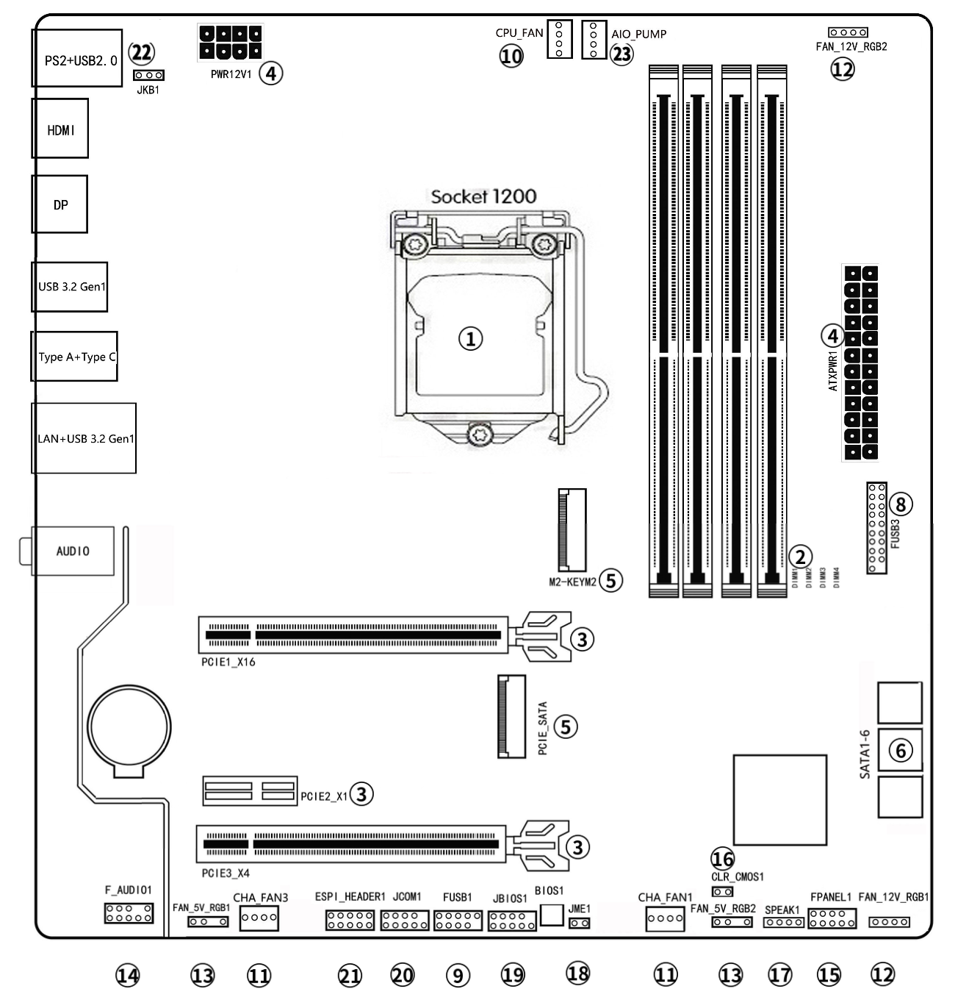
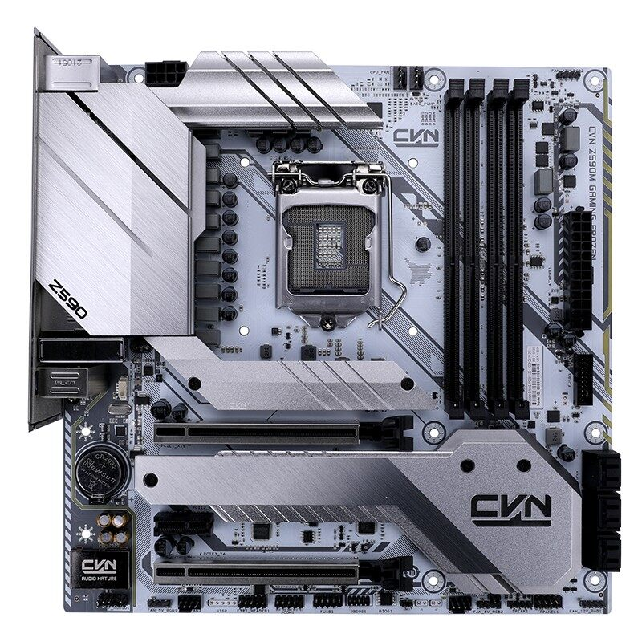

# Opencore-EFI-Z590M
colorful CVN z590m with rx580 gpu

# Who to use?

- Colorful CVN z590m mother board (also for the "forzen" version)
- 10th generation Intel cpu coded `Cometlake`
- UHD-630 integrated graphic processor
- AMD RX 580 dedicated graphic card

# How to use?

- please refer to dortania's opencore guide to create a macos installer.
- use this `EFI-OC104-iMac-UHD-RX580` as the EFI folder. you should rename `EFI-OC104-iMac-UHD-RX580` to `EFI` and put this folder into your EFI-partition
- After MacOS installation, use this EFI to replace the OS EFI. This whole process has been fully described in dortania's opencore guide.

# Why to use?

- UHD630 can perfectly function as background coding accelerator.
- Several improvements for cvn z590m.

# Miscellaneous tools for convenience

- Intel power gadget: to verify functionality of intel-igpu.
- VDADecoderChecker2: test hardware decoding viability.
- forbid-sleep.sh: disable macos automatic sleeping to avoid frequent resetting caused by malfunctioning sleeping support. 

# Credit

- thanks to dortania's opencore guide
- based on `Hackintosh EFI Folder with Clover and OpenCore` on [olarila.com](https://olarila.com/topic/5676-hackintosh-efi-folder-with-clover-and-opencore/) by `MaLd0n`

